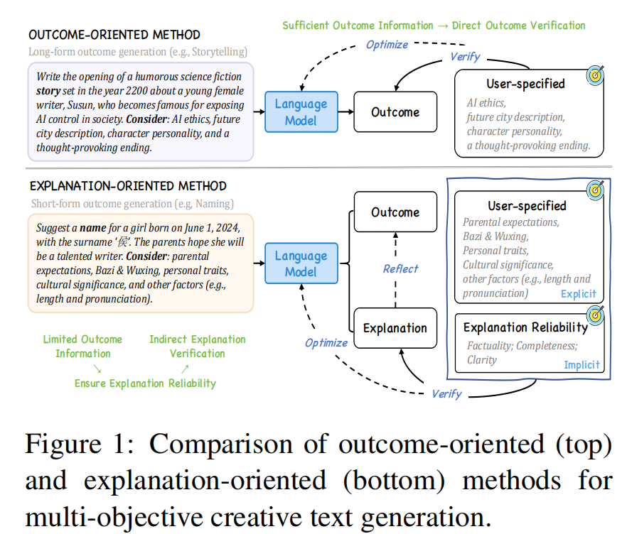
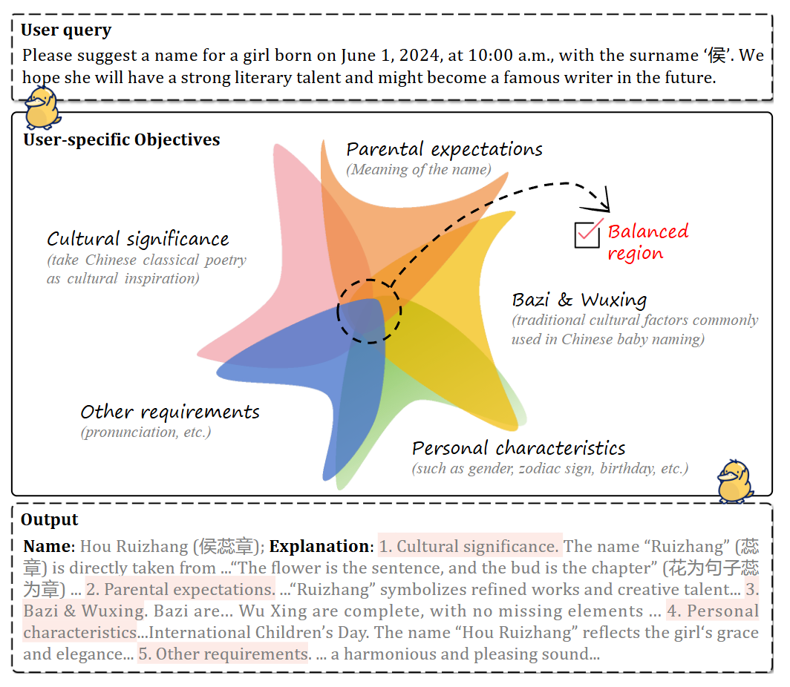
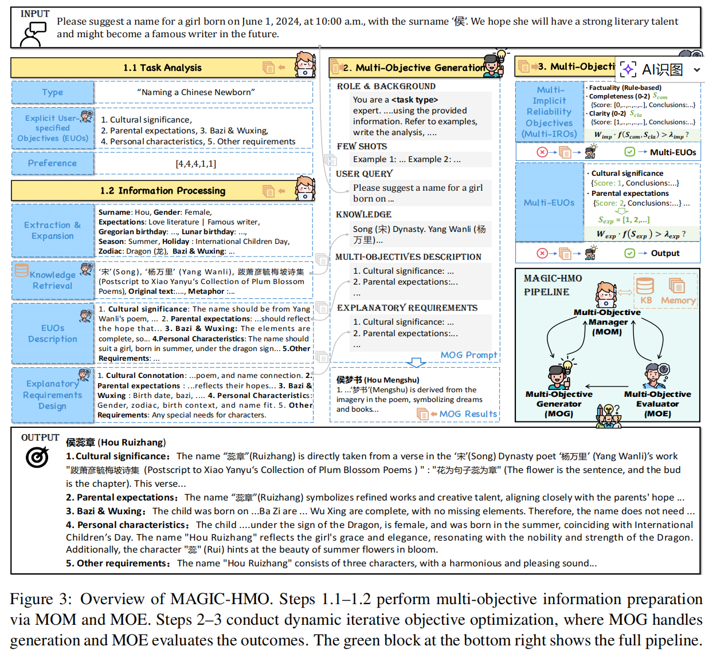
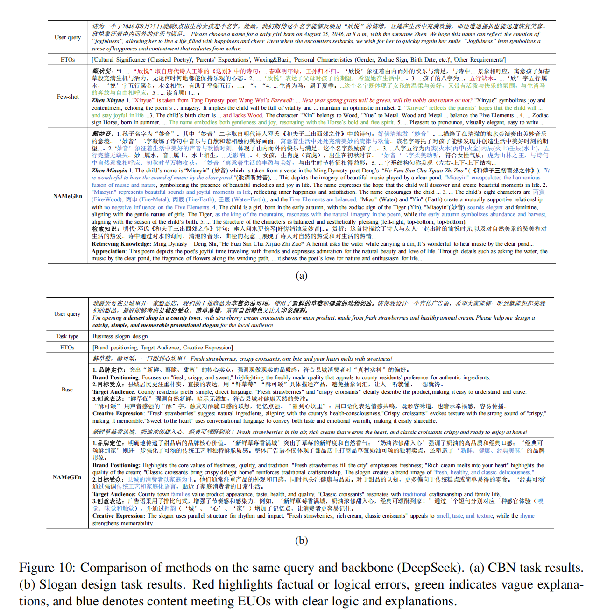

# MAGIC-HMO

### *Heterogeneous Multi-Objective Optimization for Short-form Creative NLG*

## 🧠 Teaser

<p align="center">
  
</p>

> **MAGIC-HMO** is a **training-free multi-agent framework** that formulates
> short-form creative generation as **heterogeneous multi-objective optimization**,
> jointly optimizing:
>
> * 🎯 generation quality
> * 📌 user constraints
> * 🔍 explanation reliability


## 🔥 Motivation

<p align="center">
  
</p>

Real-world creative generation (e.g., **Chinese naming**) requires balancing:

* semantic meaning
* cultural expectations
* phonetics & structure
* interpretability

⚠️ Existing approaches:

* optimize **single objective**
* ignore **reliable explanations**

➡️ We propose **multi-objective optimization with explanation awareness**


## ✨ Contributions

* **New formulation**: CNLG → **Heterogeneous Multi-Objective Optimization (HMO)**
* **Dual-objective modeling**:

  * Explicit User Objectives (**EUOs**)
  * Implicit Reliability Objectives (**IROs**)
* **Training-free multi-agent framework**
* **Explanation-aware iterative optimization**
* **Compatible with multiple LLM backbones**


## 🏗 Framework

<p align="center">
  
</p>

MAGIC-HMO consists of three collaborative agents:

### 🧩 MOM — Multi-Objective Manager

* Query understanding
* Knowledge retrieval (e.g., poetry)
* Objective refinement

### ✍️ MOG — Multi-Objective Generator

* Generates:

  * result
  * structured explanation

### 🧪 MOE — Multi-Objective Evaluator

* Evaluates:

  * IROs first
  * EUOs second
* Provides feedback for **iterative refinement**


## ⚖️ Multi-Objective Perspective

MAGIC-HMO searches for a **balanced solution**:

* satisfies **EUOs (user intent)**
* ensures **IROs (reliability)**

➡️ Equivalent to finding a **Pareto-optimal point** in objective space


## 🔍 Case Study

<p align="center">
  
</p>

* Demonstrates **iterative optimization**
* Shows how explanations guide refinement
* Achieves progressively better multi-objective satisfaction


## 🚀 Quick Start

### Environment

```bash
conda create -n magic-hmo python=3.10 -y
conda activate magic-hmo
```

### Dataset

The datasets used in this project are available on Hugging Face:

- Chinese Poems: https://huggingface.co/datasets/Audrey33/Chinese_poems
- Chinese Hanzi Poem: https://huggingface.co/datasets/Audrey33/Chinese_hanzi_poem

Due to size limitations, the full datasets are not included in this repository.

### Run

```bash
python MagicHMO.py --backbone qwen --mode batch --number 20
```

### Single Query

```bash
python MagicHMO.py \
  --backbone qwen \
  --mode single \
  --query "请为一个于2024年6月1日10:00出生的女孩起名..."
```

## 📂 Structure

```
MagicHMO.py
Agents.py
utils/
RetrivalPoems.py
data/
figs/
```

## 📌 Key Insight

> MAGIC-HMO is not just generating text —
> it is **searching for explainable and reliable solutions under multiple objectives**


## 📚 Citation

```bibtex
@article{magic_hmo,
  title={MAGIC-HMO: Heterogeneous Multi-Objective Optimization for Short-form CNLG},
  author={Anonymous},
  year={2025}
}
```
